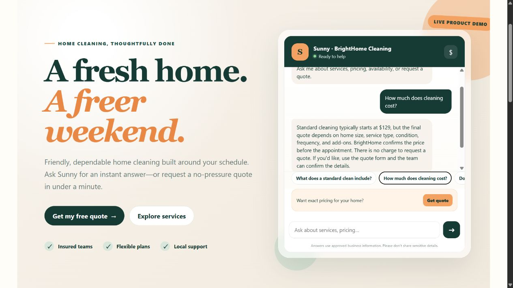
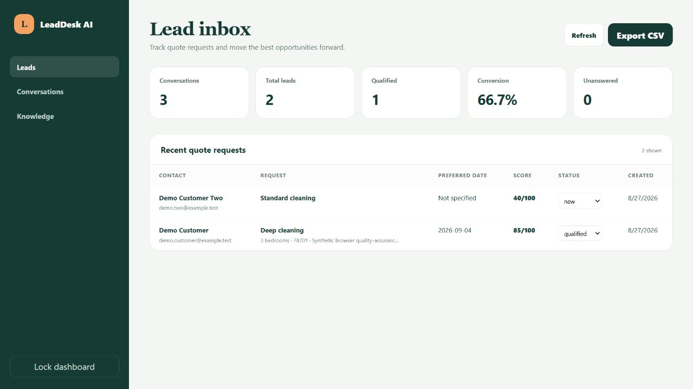

# LeadDesk AI

LeadDesk AI is a white-label website FAQ and lead-capture assistant for local service businesses. It answers from an approved knowledge base, turns high-intent visitors into structured quote requests, and gives the business a simple lead dashboard.

The included fictional **BrightHome Cleaning** site is a ready-to-demonstrate sales sample. Replace every sample claim, price, location, link, and policy with client-approved information before a real deployment.

**Live sales demo:** [leaddesk-ai-production.up.railway.app](https://leaddesk-ai-production.up.railway.app)

**Admin entrance:** [leaddesk-ai-production.up.railway.app/admin](https://leaddesk-ai-production.up.railway.app/admin) (requires the private server-side admin token)





## What is included

- Polished customer-facing demonstration website
- Embeddable floating website widget
- FAQ answers with visible source links
- Optional OpenAI mode with deterministic failover
- Structured quote form, lead scoring, and SQLite storage
- Password-token-protected admin dashboard
- Lead status workflow and safe CSV export
- Editable approved-answer knowledge base
- Optional webhook for Zapier, Make, n8n, Slack, or a CRM
- Docker and regular Python deployment options
- Railway-ready Docker deployment with persistent-volume instructions
- Tests, customer questionnaire, delivery checklist, and Upwork listing copy

## Quick start

Python 3.11 or newer is required.

```powershell
py -m venv .venv
.venv\Scripts\Activate.ps1
pip install -e ".[dev]"
Copy-Item .env.example .env
$env:ADMIN_TOKEN="choose-a-long-random-token"
uvicorn leaddesk.app:app --reload
```

Open:

- Demo website: `http://127.0.0.1:8000/`
- Standalone widget: `http://127.0.0.1:8000/widget?mode=inline`
- Admin dashboard: `http://127.0.0.1:8000/admin`
- Health check: `http://127.0.0.1:8000/health`

The app works without an API key. In that mode it returns the best matching approved answer directly. To enable more conversational answers, set a server-side `OPENAI_API_KEY`. The default `gpt-5.6-luna` model is intended for cost-sensitive, high-volume workloads; the request uses the Responses API, disables response storage, and automatically falls back if the provider is unavailable. See the official [model page](https://developers.openai.com/api/docs/models/gpt-5.6-luna) and [Responses API reference](https://developers.openai.com/api/reference/cli/resources/responses/methods/create).

## Customize for a buyer

1. Copy `.env.example` to `.env` and create a strong `ADMIN_TOKEN`.
2. Replace the fields in `data/business.json`.
3. Replace every record in `data/knowledge_base.json` with approved client information.
4. Delete `runtime/leaddesk.db` only during setup to reseed the database from the JSON file. Never delete a live database.
5. Adjust the sample site text in `src/leaddesk/static/index.html`, or embed only the widget into the client's existing site.
6. Test at least ten real customer questions, an unknown question, the quote form, admin authentication, and CSV export.

Detailed handoff steps are in [CUSTOMIZATION_CHECKLIST.md](CUSTOMIZATION_CHECKLIST.md) and [DELIVERY_GUIDE.md](DELIVERY_GUIDE.md).

## Embed on any site

After deploying the app over HTTPS, place this immediately before the website's closing `</body>` tag:

```html
<script async src="https://YOUR-LEADDESK-DOMAIN.example/widget.js"></script>
```

The script adds a small isolated iframe. The client's API key and admin token are never exposed to the host website or browser.

## Environment settings

| Variable | Required | Purpose |
|---|---:|---|
| `ADMIN_TOKEN` | Production | Protects dashboard API requests |
| `OPENAI_API_KEY` | No | Enables conversational AI answers |
| `OPENAI_MODEL` | No | Defaults to `gpt-5.6-luna` |
| `DATABASE_PATH` | No | SQLite location; defaults to `runtime/leaddesk.db` |
| `BUSINESS_FILE` | No | White-label business configuration |
| `KNOWLEDGE_FILE` | No | First-run knowledge seed |
| `STORE_CONVERSATIONS` | No | Stores questions and answers when `true` |
| `RATE_LIMIT_PER_MINUTE` | No | Per visitor/session chat limit |
| `LEAD_WEBHOOK_URL` | No | Sends a `lead.created` JSON event |
| `CORS_ORIGINS` | No | Exact comma-separated API origins |

## Deployment

### Railway — recommended for the first public sales demo

Follow [DEPLOYMENT_RAILWAY.md](DEPLOYMENT_RAILWAY.md). The application reads Railway's injected `PORT`, stores SQLite data on `/app/runtime`, rejects weak admin tokens in production, and exposes `/health` for deployment checks.

### Docker

```bash
cp .env.example .env
# Edit .env before continuing.
docker compose up --build -d
```

Persist the `/app/runtime` volume and put the service behind HTTPS. The included Compose file mounts `runtime/` for persistence.

### Standard Python host

```bash
pip install .
uvicorn leaddesk.app:app --host 0.0.0.0 --port 8000
```

Use a process manager and persistent disk. SQLite is appropriate for a small single-business deployment; migrate to PostgreSQL before multi-tenant or high-write use.

## Security and privacy boundaries

- Put secrets only in server environment variables—not JSON, HTML, chat prompts, or Git.
- Change the default admin token before exposing the service.
- Use HTTPS and platform-level request limits on public deployments.
- Obtain the client's approved copy and privacy policy before launch.
- Configure data retention and delete old leads/conversations as the client requires.
- Do not ask visitors for medical, financial, government ID, payment-card, or other sensitive data.
- The admin token is a practical small-business control, not a full multi-user identity system.
- AI answers are constrained by the approved sources, but the client must still review the final knowledge base and test responses.

## Test and quality commands

```bash
pytest
ruff check .
```

## Commercial use

This package is prepared as a productized-service starter, not an open-source template. Review and customize [COMMERCIAL_LICENSE_TEMPLATE.md](COMMERCIAL_LICENSE_TEMPLATE.md) for each sale. The template is not legal advice.
